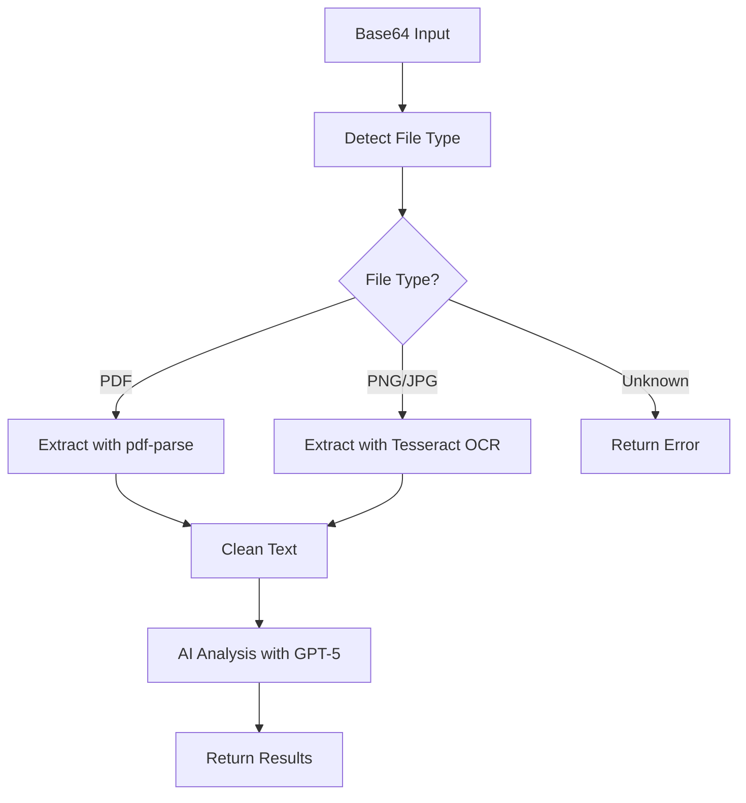

# Blood Work Text Extraction System

This system provides robust text extraction from blood work files in PDF and image formats, with intelligent file type detection and specialized processing for each format.

## 🚀 Features

- **Smart File Type Detection**: Automatically detects PDF, PNG, and JPG files from Base64 headers
- **PDF Text Extraction**: Uses `pdf-parse` library for accurate text extraction from PDF documents
- **OCR Image Processing**: Uses `tesseract.js` for optical character recognition from PNG/JPG images
- **Robust Error Handling**: Graceful fallbacks and detailed error messages
- **Text Cleanup**: Automatically trims whitespace and normalizes line breaks
- **AI Integration**: Seamlessly integrates with GPT-5 for blood work analysis

## 📁 File Structure

```
src/api/v1/
├── helper/
│   └── extractTextFromBase64.js     # Main text extraction helper
├── services/
│   └── blood.service.js             # Updated with new extraction logic
├── controller/
│   └── BloodController.js           # Added new analyze-file endpoint
└── routes/
    └── blood.js                     # Added new route
```

## 🔧 Dependencies

Make sure these packages are installed:

```bash
npm install pdf-parse tesseract.js
```

## 📚 API Endpoints

### 1. Direct File Analysis (New)
```http
POST /api/v1/blood/analyze-file
Content-Type: application/json

{
  "base64Data": "data:application/pdf;base64,JVBER..."
}
```

**Response:**
```json
{
  "success": true,
  "message": "Blood work analysis completed successfully",
  "data": {
    "extracted_text": "CBC Results: WBC 7.2...",
    "analysis": {
      "patient_info": {...},
      "results": {...},
      "metadata": {...}
    },
    "processing_info": {
      "text_length": 1250,
      "analysis_timestamp": "2025-10-11T...",
      "model_used": "gpt-5"
    }
  }
}
```

### 2. Add Blood Data with File (Enhanced)
```http
POST /api/v1/blood
Authorization: Bearer <token>
Content-Type: application/json

{
  "fileBase64": "data:image/png;base64,iVBOR..."
}
```

## 🔍 File Type Detection

The system automatically detects file types using Base64 headers:

| File Type | Base64 Header | Description |
|-----------|---------------|-------------|
| PDF       | `JVBER`       | Portable Document Format |
| PNG       | `iVBOR`       | Portable Network Graphics |
| JPG/JPEG  | `/9j/`        | JPEG Image Format |

## 💻 Usage Examples

### Basic Text Extraction
```javascript
const { extractTextFromBase64 } = require('./helper/extractTextFromBase64');

// Extract text from any supported file
const text = await extractTextFromBase64(base64Data);
console.log('Extracted text:', text);
```

### Full Blood Work Analysis
```javascript
const BloodService = require('./services/blood.service');

// Analyze blood work directly from file (without saving)
const result = await BloodService.analyzeBloodWork(base64Data);
console.log('Analysis:', result.data.analysis);

// Analyze blood work and save to user profile
const resultWithSave = await BloodService.analyzeBloodWork(base64Data, userId);
console.log('Analysis:', resultWithSave.data.analysis);
console.log('Save Result:', resultWithSave.saveResult);
```

### Custom Processing
```javascript
const { 
  extractTextFromBase64, 
  detectFileType,
  extractTextFromPDF,
  extractTextFromImage 
} = require('./helper/extractTextFromBase64');

// Detect file type first
const fileType = detectFileType(cleanBase64);

// Use specific extraction method
if (fileType === 'PDF') {
  const buffer = Buffer.from(cleanBase64, 'base64');
  const text = await extractTextFromPDF(buffer);
}
```

## ⚙️ Configuration

### OCR Settings (Tesseract.js)
The OCR engine is configured for optimal medical document processing:
- Language: English (`'eng'`)
- Progress logging enabled
- Automatic image preprocessing

### PDF Processing (pdf-parse)
PDF extraction includes:
- Multi-page support
- Text structure preservation
- Error handling for corrupted files

## 🛡️ Error Handling

The system provides comprehensive error handling:

1. **File Type Validation**: Rejects unsupported file formats
2. **Extraction Failures**: Graceful fallbacks with detailed error messages
3. **Empty Content**: Alerts when no readable text is found
4. **Corrupted Files**: Handles malformed or corrupted file data

## 🧪 Testing

Run the test file to verify functionality:

```bash
node test-blood-extraction.js
```

## 🔄 Processing Flow



## 📋 Best Practices

1. **File Size**: Keep files under 10MB for optimal processing
2. **Image Quality**: Ensure images are clear and high-contrast for better OCR
3. **PDF Format**: Text-based PDFs work better than scanned images
4. **Error Handling**: Always check the `success` flag in responses
5. **Rate Limiting**: Implement appropriate rate limits for file processing endpoints

## 🐛 Troubleshooting

### Common Issues

1. **"No text content found"**
   - Check if PDF is text-based (not scanned image)
   - Ensure image quality is sufficient for OCR
   - Verify file is not corrupted

2. **"Unsupported file type"**
   - Verify Base64 data includes proper header
   - Check if file format is PDF, PNG, or JPG

3. **OCR Processing Slow**
   - Large images take longer to process
   - Consider image compression before upload
   - Implement progress indicators for user feedback

### Debug Logging

Enable detailed logging by checking console output:
- File type detection results
- Text extraction progress
- OCR processing status
- AI analysis completion

## 🔮 Future Enhancements

- Support for additional file formats (TIFF, BMP)
- Image preprocessing for better OCR accuracy
- Batch file processing capabilities
- Real-time progress tracking
- Advanced text cleaning and validation